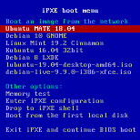

**Linux Terminal Server Project** helps in netbooting LAN clients from a single template installation that resides in a virtual machine image or a chroot on the LTSP server, or the server root (/, chrootless). This way maintaining tens or hundreds of diskless clients is as easy as maintaining a single PC.

LTSP has been [redesigned and rewritten from scratch in 2019](https://github.com/ltsp/ltsp/discussions/268) by [alkisg](https://github.com/alkisg) in order to support new technologies like systemd, updated desktop environments, Wayland, UEFI etc. Only the new version is actively developed, while the old one is now called LTSP5 and is in minimal maintenance mode.

LTSP automatically configures and uses the following tools:
- [iPXE](https://packages.debian.org/stable/ipxe): network boot loader that shows the initial client boot menu and loads the kernel/initrd.
- [dnsmasq](https://packages.debian.org/stable/dnsmasq) or [isc-dhcp-server](https://packages.debian.org/stable/isc-dhcp-server): DHCP server that assigns IPs to the clients, or ProxyDHCP server when another DHCP server is used, e.g. a router.
- [dnsmasq](https://packages.debian.org/stable/dnsmasq) or [tftpd-hpa](https://packages.debian.org/stable/tftpd-hpa): TFTP server that sends ipxe/kernel/initrd to the clients.
- [dnsmasq](https://packages.debian.org/stable/dnsmasq): optional DNS server for DNS caching or blacklisting.
- [mksquashfs](https://packages.debian.org/stable/squashfs-tools): creates a compressed copy of the template image/chroot/VM to be used as the client root /.
- [NFS](https://packages.debian.org/stable/nfs-kernel-server) or [NBD](https://packages.debian.org/stable/nbd-server): serve the squashfs image to the network.
- tmpfs and overlayfs: make the squashfs image temporarily writable for each client, similiarly to live CDs.
- [NFS](https://packages.debian.org/stable/nfs-kernel-server) or [SSHFS](https://packages.debian.org/stable/sshfs): access the user's /home directory which resides on the server.
- [SSH](https://packages.debian.org/stable/openssh-server) or [SSHFS](https://packages.debian.org/stable/sshfs) or [LDAP](https://packages.debian.org/stable/ldap-utils): authenticate users against the server.

What are you waiting for? Continue to the [installation page](docs/installation)!
